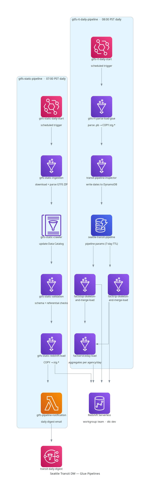

# /glue
AWS Glue 4.0 ETL jobs for the Seattle Transit data warehouse — ingestion, parsing, validation, and fact-table loading.

---

## Pipelines

Two daily Glue workflows run in sequence via scheduled triggers:

### 1. `gtfs-static-pipeline` — 07:00 PST (14:00 UTC)

Ingests the GTFS static schedule feed, validates it, and loads it to Redshift. On completion, triggers a daily digest email.

```
gtfs-static-daily-start (SCHEDULED)
  └─► gtfs-static-ingestion
        └─► gtfs-static-crawler   ← updates Glue Data Catalog
              └─► gtfs-static-validation
                    └─► gtfs-static-redshift-load
                          └─► gtfs-pipeline-notification (Lambda)
```

### 2. `gtfs-rt-daily-pipeline` — 08:00 PST (15:00 UTC)

Parses GTFS-RT protobufs accumulated overnight, derives fact tables, and loads them.

```
gtfs-rt-daily-start (SCHEDULED)
  └─► gtfs-rt-parse-load-glue
        └─► transit-pipeline-inspector
              ├─► factstop-skeleton-and-merge-load
              ├─► facttrip-skeleton-and-merge-load
              └─► factserviceday-load
```

---

## Jobs in Production

All jobs run on **Glue 4.0**, worker type **G.1X**.

| Glue Job Name | Script | Workers | Timeout | Pipeline | Notes |
|---|---|---|---|---|---|
| `gtfs-static-ingestion` | `gtfs_static_ingestion.py` | 2 | 60 min | static | |
| `gtfs-static-validation` | `gtfs_static_validation.py` | 2 | 60 min | static | |
| `gtfs-static-redshift-load` | `gtfs_static_redshift_load.py` | 2 | 60 min | static | |
| `gtfs-static-crawler` | *(Glue Crawler)* | — | — | static | |
| `gtfs-rt-parse-load-glue` | `gtfs-rt-parse-load-glue.py` | 4 | 40 min | rt | |
| `transit-pipeline-inspector` | `transit_pipeline_inspector_v2.py` | 2 | 15 min | rt | |
| `factstop-skeleton-and-merge-load` | `factstop_skeleton_and_merge_v2.py` | 2 | 20 min | rt | |
| `facttrip-skeleton-and-merge-load` | `facttrip_skeleton_and_merge_v2.py` | 2 | 20 min | rt | MaxConcurrentRuns=3 |
| `factserviceday-load` | `factserviceday_load_v2.py` | 2 | 15 min | rt | |

> **Not in production:** `glue_rt_polling.py` — an older Glue-based RT poller, superseded by the Lambda function at `lambda/gtfs-rt-polling/`. The active poller is the Lambda, triggered by EventBridge every 1 minute. Both write to the same S3 key format (`gtfs-rt/{agency}/{feed_type}/{YYYY/MM/DD/HHmmss}.pb`) — running both simultaneously would cause duplicate writes.



---

## Job Descriptions

### `gtfs-static-crawler`
Glue Crawler targeting `s3://seattle-transit-staging/gtfs-static/`. Runs after `gtfs-static-ingestion` to update the Glue Data Catalog (`seattle_transit_staging` database) so downstream jobs and ad-hoc Athena queries see the latest partitions. The Data Catalog database is created automatically if absent at deploy time.

### `gtfs_static_ingestion.py`
Downloads the GTFS static zip from the OBA API, extracts CSV feeds, parses them (using `csv.reader` to handle quoted fields), and writes to `s3://seattle-transit-staging/gtfs-static/`. Computes a SHA-256 hash to skip re-ingestion if the feed hasn't changed.

### `gtfs_static_validation.py`
Validates the staged GTFS static CSVs against expected schema and referential integrity rules using Spark DataFrames. Each table is `cache()`/`unpersist()`'d around its checks. Null checks use a single aggregation pass (not one scan per column).

### `gtfs_static_redshift_load.py`
Loads validated static CSVs from staging into `stg.*` Redshift tables via `COPY`. Uses a single `list_objects_v2` call against the known date prefix rather than paginating all date folders.

### `gtfs-rt-parse-load-glue.py`
Reads accumulated GTFS-RT `.pb` protobuf files from `s3://seattle-transit-raw/gtfs-rt/` for yesterday's date. Parses trip updates and vehicle positions, deduplicates incrementally (dict-keyed by natural key, keeping the latest `feed_timestamp_utc`), writes CSVs to staging, then COPYs into `stg.rt_stop_time_updates` and `stg.rt_vehicle_positions`.

Key implementation details:
- **Parallel S3 reads**: `ThreadPoolExecutor(16)` with per-thread boto3 clients (`threading.local()`) — boto3 clients are not thread-safe
- **Generator-based**: `read_pb_files_parallel()` yields feeds one at a time so memory never holds all parsed protobufs simultaneously
- **Incremental dedup**: builds a `dict[key → record]` as each feed arrives, eliminating the accumulate-all-then-deduplicate OOM pattern; compares raw integer `feed_ts` (not parsed datetime) for speed
- **BytesIO staging writes**: `write_csv_to_staging()` uses `io.BytesIO` + `io.TextIOWrapper` instead of `StringIO` + encode, eliminating an intermediate string copy
- **Cached `HasField` calls**: `extract_vehicle_positions()` caches `v.HasField('trip')` and `v.HasField('vehicle')` per record to avoid redundant protobuf reflection
- **Parallel Redshift COPY**: `copy_to_redshift_parallel()` submits all DELETE statements concurrently, waits for all to finish, then submits all COPY statements concurrently — replacing 4 serial waits with 2 parallel rounds (~3× wall-time reduction in the Redshift phase)

### `transit_pipeline_inspector_v2.py`
Sits between `gtfs-rt-parse-load-glue` and the fact jobs. Queries Redshift staging to find date gaps across FactStop, FactTrip, and FactServiceDay. Writes job parameters (dates, phase, force flag) to DynamoDB table `seattle-transit-pipeline` with a 7-day TTL. Downstream fact jobs read their own parameters on startup via `lib/pipeline_param_reader_v2.py`.

**FSD gap detection (two-source approach):** `get_factserviceday_gaps()` queries `FactTrip WHERE tripstatus='OPERATED'` — but the inspector runs before FactTrip merge, so dates that only have MISSED rows are invisible to that query. The fix: gaps for dates that FactTrip *will* process (from `facttrip_params.gap_dates` in DynamoDB) are unioned directly into the FSD gap list without going through the OPERATED-row query. Only historical dates not covered by FactTrip are queried against Redshift.

### `factstop_skeleton_and_merge_v2.py`
**Phase 1 (skeleton):** Explodes the GTFS static schedule into one `FactStop` row per stop visit per trip per service date. All actual columns NULL on insert. Idempotent.

**Phase 2 (merge):** Joins `stg.rt_stop_time_updates` against skeleton rows and updates `ActualArrival`, `ArrivalDevSeconds`, and OTP flags. Only targets `FALLBACK_SCHEDULED` rows (unless `--force` is set). Fixed a double `get_statement_result` bug — `run_sql` now returns `(status_resp, query_id)` and the caller polls once.

### `facttrip_skeleton_and_merge_v2.py`
**Phase 1 (skeleton):** One `FactTrip` row per trip per service date, including cancelled trips. Computes `ScheduledVRM` from `stg.shapes` and `ScheduledVRH` from `stg.stop_times`.

**Phase 2 (merge):** Derives `TripStatus` from `stg.rt_vehicle_positions` (ping presence + `calendar_dates`). Populates actual times, ping counts, `RTCoverageRate`, `ReportedVRH`, `IsEstimated`, `IsOfficial`. ADDED trips inserted separately.

**RTCoverageRate overflow fix:** `RTCoverageRate` is stored as `NUMERIC(5,4)` (max 9.9999). Burst-pinging vehicles (e.g. 35 pings in 30 s) produced rates >9.9999, causing a numeric overflow error. Both `rt_merge_update_sql()` and `added_trips_insert_sql()` now wrap the rate in `LEAST(1.0, ...)` — semantically correct since coverage cannot exceed 100%.

### `factserviceday_load_v2.py`
Aggregates `FactTrip` into one row per agency per service date: trip counts by status, `MissedTripRate` (NTD convention), VRM/VRH totals, and peak vehicle count (VOMS). DELETE + INSERT for idempotency.

**VOMS algorithm:** Non-equi join `FactTrip × DimTime` — a trip is active at minute M when `minutes_from_midnight(ActualStartTime) ≤ DimTime.TimeKey ≤ minutes_from_midnight(ActualEndTime)`. Uses window functions (`FIRST_VALUE OVER`, `MAX OVER`) to find peak — replaced an O(n²) correlated subquery.

---

## Shared Library

### `lib/pipeline_param_reader_v2.py`
Shared utility imported by all three fact jobs. Reads `dates`, `phase`, `force`, and `skip` parameters from DynamoDB as written by `transit-pipeline-inspector`. Falls back to `--start_date`/`--end_date` CLI args when DynamoDB has no entry (useful for manual backfills).

---

## Deploy

Jobs are deployed via `deploy/deploy_glue.sh`. Scripts are uploaded to `s3://seattle-transit-staging/glue-scripts/v2/` before job definitions are created/updated.

```bash
bash deploy/deploy_glue.sh           # full deploy
bash deploy/deploy_glue.sh --dry-run # print changes only
bash deploy/deploy_glue.sh --upload-only # upload scripts then exit
```

To upload a single changed script without a full deploy:

```bash
source deploy/config.env
aws s3 cp glue/jobs/<script>.py "${SCRIPTS}/<script>.py"
```

---

## Related

- [`lambda/gtfs-rt-polling/`](../lambda/gtfs-rt-polling/) — active RT feed poller (EventBridge, 1-min interval)
- [`deploy/deploy_glue.sh`](../deploy/deploy_glue.sh) — job and workflow deploy script
- [`deploy/config.env`](../deploy/config.env) — S3 buckets, IAM roles, Redshift config
